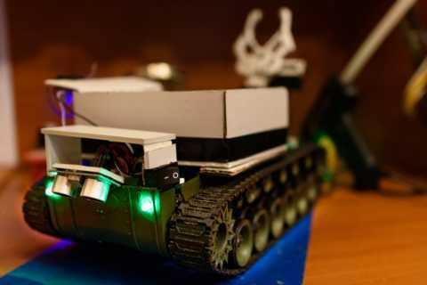
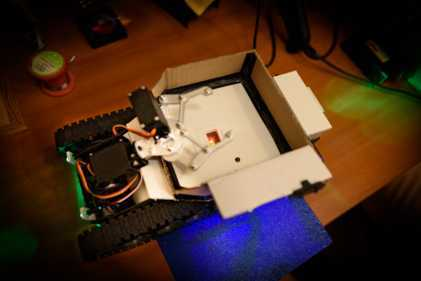

Программное обеспечение ДУМРОНа
===============================

**ДУМРОН** (Дистанционно Управляемый Мобильный Робот Общего Назначения)

Робот на танковом шасси, оснащённый:
- двумя сервомоторами (плечо и клешня манипулятора);
- двумя датчиками температуры DS18B20 (внутренний и внешний);
- ультразвуковым дальномером HC-SR04 (для обнаружения обрыва или препятствия при движении назад);
- передними и задними светодиодами (освещение);
- пьезопищалкой (для возможности привлечения внимания;
- радиомодулем NRF24L01+ (для связи с пультом)

В роботе используется микроконтроллер STM32F103C8T6 и операционная система реального времени
FreeRTOS.

Дистанционное управление осуществляется с пульта, прошивка которого находится
в репозитории [DUMRON_RC](https://github.com/Danya0x07/DUMRON_RC). 
С пульта можно:
- управлять движением робота;
- управлять движением манипулятора;
- включать/выключать светодиоды и пищалку. 

От робота на пульт приходят данные:
- о температуре
    - внутри корпуса; 
    - окружающей среды;
- о заряде аккумуляторов
    - силовой части;
    - "мозговой" части;
- о расстоянии от кормы робота до поверхности.

В случае, если расстояние от заднего дальномера больше определённого значения,
делается вывод о наличии опасного перепада высоты позади робота, 
и движение назад блокируется.

Также на роботе имеется FPV-камера, в реальном времени транслирующая 
изображение на телефон. Она никак не связана с программой и от робота ей нужно
только питание.

> Вследствие использования кодогенератора CubeMX, входящего в состав STM32CubeIDE, 
получился конфликт code style-ов: мой код написан в snake_case, 
сгенерированный - в Mixed_Case, а код фреймворка CMSIS-RTOS - в camelCase.
Поэтому было решено библиотеки периферийных модулей (не зависящие от ST-шных библиотек) 
оставить в snake_case, а модули вышестоящего слоя сделать в Mixed_Case, 
чтобы приятнее смотрелось.
Также я придерживаюсь отступов в 4 пробела, а CubeMX - в 2. Тут ничего не поделать,
просто нужно отступать пустые строчки между комментариями CubeMX
(`/* USER CODE BEGIN ... */`, `/* USER CODE END ... */`) и своим кодом.
